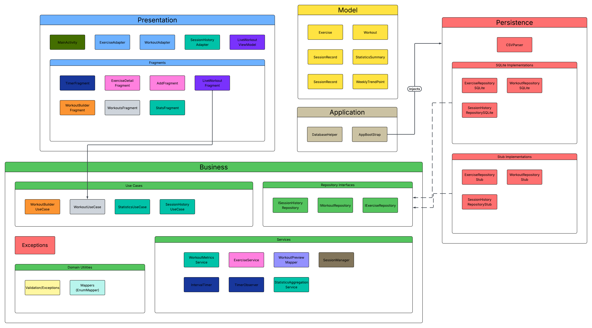

# ARCHITECTURE

### Major Packages

- **`presentation`** - User interface components and views
- **`business`** - Business logic and use cases
- **`persistence`** - Data access layer and repositories
- **`application`** - Configuration and setup
- **`model`** - Domain specific objects

## Layered Architecture

### Presentation Layer (UI)

- **[`MainActivity`](app/src/main/java/com/example/exergen/presentation/MainActivity.java)**
  - Entry point of the app
  - Acts as the composition root for presentation dependency injection
  - User input handling
- **[`AddFragment`](app/src/main/java/com/example/exergen/presentation/AddFragment.java)**
  - Displays a list of all exercises available in the library
- **[`StatsFragment`](app/src/main/java/com/example/exergen/presentation/StatsFragment.java)**
  - Displays personal workout statistics and trends
- **[`TimerFragment`](app/src/main/java/com/example/exergen/presentation/TimerFragment.java)**
  - Simple standalone timer for work/rest intervals
- **[`WorkoutsFragment`](app/src/main/java/com/example/exergen/presentation/WorkoutsFragment.java)**
  - Displays a list of user's saved workouts and allows viewing details or deleting them
- **[`ExerciseDetailFragment`](app/src/main/java/com/example/exergen/presentation/ExerciseDetailFragment.java)**
  - Displays detailed information about a specific exercise (instructions, equipment, etc.)
- **[`LiveWorkoutFragment`](app/src/main/java/com/example/exergen/presentation/LiveWorkoutFragment.java)**
  - Interactive screen that guides the user through an active workout session by observing `LiveWorkoutViewModel`
- **[`TimerViewModel`](app/src/main/java/com/example/exergen/presentation/TimerViewModel.java)** / **[`LiveWorkoutViewModel`](app/src/main/java/com/example/exergen/presentation/LiveWorkoutViewModel.java)**
  - Own timer/session coordination and expose observable UI state to fragments
- **[`LiveWorkoutUiState`](app/src/main/java/com/example/exergen/presentation/LiveWorkoutUiState.java)**
  - Presentation state model for setup/active/finished live workout screen transitions
- **[`ExerciseAnimationManager`](app/src/main/java/com/example/exergen/presentation/ExerciseAnimationManager.java)** / **[`SoundFeedbackHelper`](app/src/main/java/com/example/exergen/presentation/SoundFeedbackHelper.java)**
  - Shared helpers that centralize animation frame loading and audio cues
- **[`ExerciseAdapter`](app/src/main/java/com/example/exergen/presentation/ExerciseAdapter.java)**
  - RecyclerView adapter that binds pre-mapped `ExerciseListItem` rows
- **[`WorkoutAdapter`](app/src/main/java/com/example/exergen/presentation/WorkoutAdapter.java)**
  - RecyclerView adapter that binds pre-mapped `WorkoutListItem` rows
- **[`SessionHistoryAdapter`](app/src/main/java/com/example/exergen/presentation/SessionHistoryAdapter.java)**
  - RecyclerView adapter that binds pre-mapped `SessionHistoryListItem` rows
- **[`ExerciseListItem`](app/src/main/java/com/example/exergen/presentation/ExerciseListItem.java)** / **[`WorkoutListItem`](app/src/main/java/com/example/exergen/presentation/WorkoutListItem.java)** / **[`SessionHistoryListItem`](app/src/main/java/com/example/exergen/presentation/SessionHistoryListItem.java)**
  - Presentation row models used to keep formatting/mapping out of adapters

### Business Layer

#### `business/usecase/`

- **[`WorkoutUseCase`](app/src/main/java/com/example/exergen/business/usecase/WorkoutUseCase.java)**
  - Coordinates operations related to workout management (saving, loading, deleting)
- **[`StatisticsUseCase`](app/src/main/java/com/example/exergen/business/usecase/StatisticsUseCase.java)**
  - Provides the business logic for calculating and retrieving user statistics
- **[`SessionHistoryUseCase`](app/src/main/java/com/example/exergen/business/usecase/SessionHistoryUseCase.java)**
  - Manages the recording and retrieval of completed workout sessions
- **[`WorkoutBuilderUseCase`](app/src/main/java/com/example/exergen/business/usecase/WorkoutBuilderUseCase.java)**
  - Logic for generating or building workouts based on specific criteria
- **[`ExerciseUseCase`](app/src/main/java/com/example/exergen/business/usecase/ExerciseUseCase.java)**
  - Use case entry point for exercise read operations used by presentation
- **[`TimerSessionUseCase`](app/src/main/java/com/example/exergen/business/usecase/TimerSessionUseCase.java)**
  - Business abstraction that encapsulates timer session lifecycle and observer callbacks
- **[`TimerMode`](app/src/main/java/com/example/exergen/business/usecase/TimerMode.java)** / **[`TimerSessionObserver`](app/src/main/java/com/example/exergen/business/usecase/TimerSessionObserver.java)**
  - Use-case level timer state contract consumed by presentation viewmodels

#### `business/service/`

- **[`ExerciseService`](app/src/main/java/com/example/exergen/business/service/ExerciseService.java)**
  - High-level service for exercise library operations (filtering, searching)
- **[`IntervalTimer`](app/src/main/java/com/example/exergen/business/service/IntervalTimer.java)**
  - Core countdown logic for work/rest interval sets
- **[`TimerObserver`](app/src/main/java/com/example/exergen/business/service/TimerObserver.java)**
  - Interface for receiving ticks and phase changes from a timer
- **[`SessionManager`](app/src/main/java/com/example/exergen/business/service/SessionManager.java)**
  - Tracks progress and state during an active workout session
- **[`WorkoutMetricsService`](app/src/main/java/com/example/exergen/business/service/WorkoutMetricsService.java)**
  - Utility for calculating workout-related metrics (total duration, etc.)
- **[`StatisticsAggregationService`](app/src/main/java/com/example/exergen/business/service/StatisticsAggregationService.java)**
  - Aggregates raw session data into meaningful summary statistics
- **[`EnumMapper`](app/src/main/java/com/example/exergen/business/service/EnumMapper.java)**
  - Helper for mapping between domain enums and UI-friendly strings/indices
  
### Persistence Layer

- **[`IExerciseRepository`](app/src/main/java/com/example/exergen/persistence/repository/IExerciseRepository.java)** / **[`IWorkoutRepository`](app/src/main/java/com/example/exergen/persistence/repository/IWorkoutRepository.java)** / **[`ISessionHistoryRepository`](app/src/main/java/com/example/exergen/persistence/repository/ISessionHistoryRepository.java)**
    - Persistence-facing repository interfaces consumed by business layer use cases/services
- **[`ExerciseRepositoryStub`](app/src/main/java/com/example/exergen/persistence/ExerciseRepositoryStub.java)**
    - In-memory implementation of the exercise repository
- **[`WorkoutRepositoryStub`](app/src/main/java/com/example/exergen/persistence/WorkoutRepositoryStub.java)**
    - In-memory implementation of the workout repository
- **[`SessionHistoryRepositoryStub`](app/src/main/java/com/example/exergen/persistence/SessionHistoryRepositoryStub.java)**
    - In-memory implementation of the session history repository
- **[`ExerciseRepositorySQLite`](app/src/main/java/com/example/exergen/persistence/ExerciseRepositorySQLite.java)**
    - SQLite implementation of the exercise repository for persistent storage
- **[`WorkoutRepositorySQLite`](app/src/main/java/com/example/exergen/persistence/WorkoutRepositorySQLite.java)**
    - SQLite implementation of the workout repository for persistent storage
- **[`SessionHistoryRepositorySQLite`](app/src/main/java/com/example/exergen/persistence/SessionHistoryRepositorySQLite.java)**
    - SQLite implementation of the session history repository for persistent storage

### Application

- **[`AppBootstrap`](app/src/main/java/com/example/exergen/application/AppBootstrap.java)**
  - Central service locator and configuration hub for dependency injection

### Model

- **[`Exercise`](app/src/main/java/com/example/exergen/model/Exercise.java)**
  - Domain model for an exercise (id, name, muscles, equipment, etc.)
- **[`Workout`](app/src/main/java/com/example/exergen/model/Workout.java)**
  - Domain model for a workout that stores `sets` and an immutable list of `WorkoutStep`
- **[`WorkoutStep`](app/src/main/java/com/example/exergen/model/WorkoutStep.java)**
  - Domain model for a single workout step (`exerciseId`, `workSeconds`, `restSeconds`), replacing parallel lists
- **[`SessionRecord`](app/src/main/java/com/example/exergen/model/SessionRecord.java)**
  - Represents a completed workout session with timestamp, exercise count, and sets planned/completed
- **[`StatisticsSummary`](app/src/main/java/com/example/exergen/model/StatisticsSummary.java)**
  - Value object holding aggregated statistical data
- **[`WeeklyTrendPoint`](app/src/main/java/com/example/exergen/model/WeeklyTrendPoint.java)**
  - Data point for visualizing weekly workout trends
- **[`EquipmentType`](app/src/main/java/com/example/exergen/model/EquipmentType.java)** / **[`MuscleGroup`](app/src/main/java/com/example/exergen/model/MuscleGroup.java)**
  - Enums representing domain-specific categories
