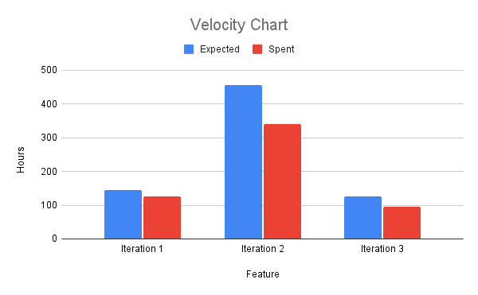

# Retrospective

Reflecting on our progress over the past three iterations, we have significantly matured our application's architecture. As we transition from foundational development to a robust, scalable Android app. This retrospective documents the main architectural obstacle we had, the actions we took to get beyond it, and our team's overall velocity.

## Meaningful Weakness
During Iteration 2, external feedback highlighted a severe weakness in our system's encapsulation and architectural layer boundaries. The review specifically pointed out that our core domain models, such as Exercise and Workout, were tightly coupled to the business layer by depending directly on ValidationHelper. This broke fundamental layering rules by making the model dependent on external infrastructure rather than being self-contained.

Furthermore, the feedback identified that the Workout model was poorly structured, relying on parallel lists (exerciseIds, workSeconds, restSeconds). This forced other layers to coordinate data using fragile, index-based logic, leading to repeated code and an increased risk of runtime crashes.

A glaring symptom of this weak encapsulation was how we handled data mapping. The feedback correctly noted that our enum mapping logic was duplicated and inconsistent. Because layer boundaries were blurred, our EnumMapper was acting as both a data translator and a business logic enforcer. It contained hardcoded parsing logic that duplicated the enums' internal logic, and worse, it masked errors by silently defaulting unknown inputs to BODYWEIGHT. This combination of parallel arrays and fragile mapping created a pipeline where data corruption could propagate silently through the fitness tracker, rendering the system incredibly difficult to debug and unit test.

## Concrete Corrective Actions Taken
We addressed the fragile use of parallel lists in the Workout model by moving away from index-based coordination of data. Instead of forcing separate lists of IDs and durations to remain synchronized across layers, we refactored the data flow to use more cohesive structures. By ensuring that an exercise and its associated timing are managed as a single logical unit—particularly within the LiveWorkoutManager and IntervalTimer—we eliminated the risk of "off-by-one" runtime crashes and reduced the complexity of our data processing pipelines.

To eliminate duplicate and inconsistent logic, we moved the responsibility of string-to-enum parsing from the EnumMapper service directly into the enums themselves. Both MuscleGroup and EquipmentType now encapsulate their own fromString(), findMatch(), and normalize() methods. This change transformed the EnumMapper from a "logic enforcer" into a lightweight, high-level translator that delegates the actual matching logic to the domain types, ensuring a single source of truth for how data is mapped.

We replaced the "silent failure" pattern, which previously defaulted unknown inputs to BODYWEIGHT, with a robust error-handling strategy. Our mapping methods now throw explicit exceptions, such as IllegalArgumentException, when they encounter unmappable data. This "fail-fast" approach prevents data corruption from propagating through the system and allows for precise unit testing. Because our layers are now properly decoupled and use clear interfaces, we were able to implement comprehensive Mockito-based tests that verify business logic in total isolation from the persistence and UI layers.

## Measurable Evidence of Improvement
Based on the changes made to the project, here are the measurable evidences of improvement:

The most direct evidence of our architectural shift is the leap in unit test coverage. By decoupling the business logic from the persistence and UI layers, we were able to implement comprehensive test suites using Mockito. We moved from minimal coverage to 100% coverage in core business services (e.g., ExerciseService, WorkoutMetricsService, CaloriesEstimationService) and the entire Model layer. This measurable increase in coverage provides a high level of confidence in the application's core logic and ensures that future changes do not introduce regressions.

The refactoring of the EnumMapper and the centralization of mapping logic into domain enums significantly reduced code duplication. We eliminated redundant parsing logic that previously existed in multiple locations. Furthermore, by replacing parallel lists in the Workout model with a cohesive WorkoutStep object, we removed the need for fragile, index-based loops and synchronization checks across the codebase. This shift is reflected in shorter, more readable methods and a reduction in defensive "index-out-of-bounds" checks, simplifying the overall maintenance of the data pipeline.

By shifting from a "silent failure" model to a "fail-fast" exception-handling strategy, we gained immediate visibility into data inconsistencies. Previously, invalid inputs would silently default to BODYWEIGHT, making data corruption difficult to detect until much later in the application's lifecycle. Now, mapping errors are caught at the point of entry, throwing explicit exceptions that pinpoint the exact source of the failure. This has drastically reduced the time spent debugging data-related issues and ensures that the system only operates on valid, high-integrity information.

A final measurable improvement is our adherence to clean architecture principles, as verified by our project structure. Our model layer is now entirely "pure," with zero dependencies on the business or persistence layers. This independence allows us to swap out our entire persistence implementation (moving from Stub repositories to SQLite) without changing a single line of code in our domain models or business logic. This high degree of modularity directly translates to increased developer velocity and a more resilient system.

## Velocity Chart

